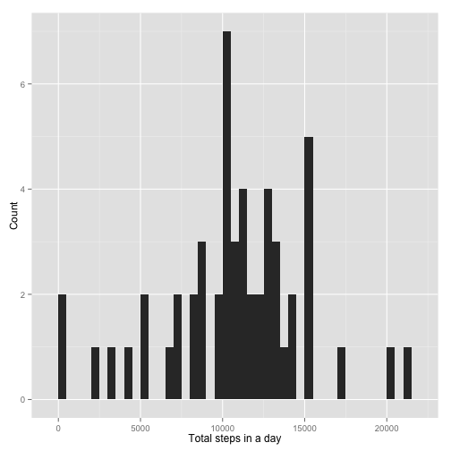
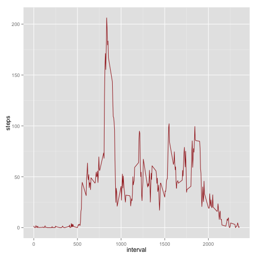
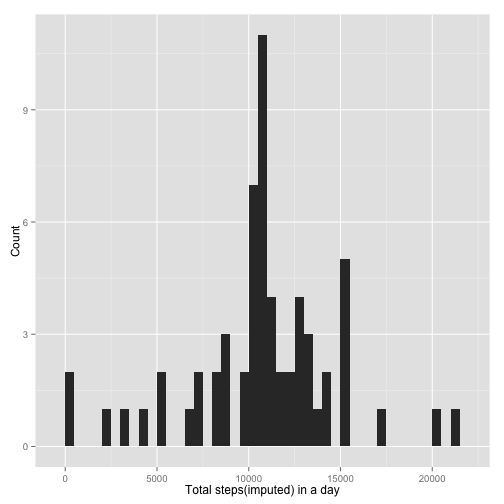
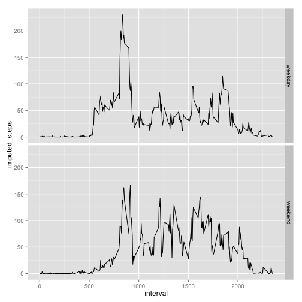

## Reproducible Research: Peer Assessment 1
Corresponds to the problem statemen given [here] (https://github.com/rdpeng/RepData_PeerAssessment1)

### Loading and preprocessing the data

```r
activity_data <- read.csv("activity.csv", header=TRUE, sep=",", 
                          na.strings="NA", comment.char="")
summary(activity_data)
```

```
##      steps               date          interval   
##  Min.   :  0.0   2012-10-01:  288   Min.   :   0  
##  1st Qu.:  0.0   2012-10-02:  288   1st Qu.: 589  
##  Median :  0.0   2012-10-03:  288   Median :1178  
##  Mean   : 37.4   2012-10-04:  288   Mean   :1178  
##  3rd Qu.: 12.0   2012-10-05:  288   3rd Qu.:1766  
##  Max.   :806.0   2012-10-06:  288   Max.   :2355  
##  NA's   :2304    (Other)   :15840
```

### What is mean total number of steps taken per day?


```r
library(ggplot2)
daily_steps <- aggregate(steps ~ date, data = activity_data, sum )
qplot(daily_steps$steps, xlab="Total steps in a day", ylab="Count", binwidth=500)
```

 

```r
steps_mean <- mean(daily_steps$steps)
steps_median <- median(daily_steps$steps)
```
The mean of total number of steps taken per day is **1.0766 &times; 10<sup>4</sup>** and median is **10765**

### What is the average daily activity pattern?

```r
interval_steps <- aggregate(steps ~ interval, data = activity_data, mean)
ggplot(interval_steps, aes(x=interval, y=steps)) + geom_line(col="brown")
```

 

```r
max_interval <- interval_steps[which.max(interval_steps$steps), ]$interval
```
The 5-minute interval having maximum steps on average across all the days is **835**

### Imputing missing values
Filling up NAs with median of steps for that interval

```r
library(zoo)
```

```
## 
## Attaching package: 'zoo'
## 
## The following objects are masked from 'package:base':
## 
##     as.Date, as.Date.numeric
```

```r
total_missing_value <- sum(is.na(activity_data$steps))
activity_data$imputed_steps <- with(activity_data, na.aggregate(steps, by = interval, FUN = mean))
imputed_daily_steps <- aggregate(imputed_steps ~ date, data = activity_data, sum )
qplot(imputed_daily_steps$imputed_steps, xlab="Total steps(imputed) in a day", ylab="Count", binwidth=500)
```

 

```r
imputed_steps_mean <- mean(imputed_daily_steps$imputed_steps)
imputed_steps_median <- median(imputed_daily_steps$imputed_steps)
```
Total missing values are **2304**  

The mean of total number of steps taken per day is **1.0766 &times; 10<sup>4</sup>** 
and median is **1.0766 &times; 10<sup>4</sup>**  
Mean has remained same, but the median has changed slightly from **10765** 
to **1.0766 &times; 10<sup>4</sup>** 

### Are there differences in activity patterns between weekdays and weekends?
Adding new field "day_type" to represent weekday and weekend (Saturday, Sunday)

```r
activity_data$day_type <- "weekday"
activity_data[weekdays(strptime(activity_data$date, "%Y-%m-%d")) 
              %in% c("Saturday", "Sunday"), ]$day_type <- "weekend"
interval_steps <- aggregate(imputed_steps ~ interval + day_type, data = activity_data, mean)
ggplot(data=interval_steps, aes(x=interval, y=imputed_steps)) + geom_line() + facet_grid(day_type ~ .)
```

 
